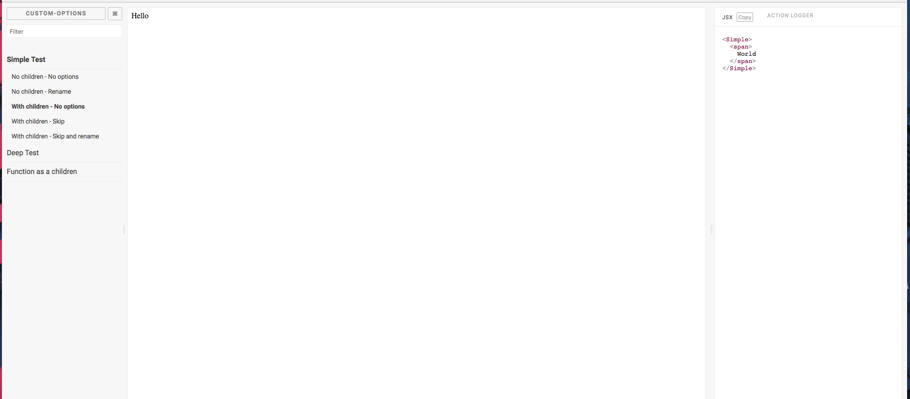

<p align="center">
  
  <br>
  <h1 style="text-align:center;">Storybook-addon-jsx</h1>
</p>

[](https://travis-ci.org/Kilix/storybook-addon-jsx)
[](https://www.npmjs.com/package/storybook-addon-jsx)
[](https://www.npmjs.com/package/storybook-addon-jsx)

This Storybook addon shows you the JSX of the story.
It can be useful to see what props you set, for example.



## Getting started

### Installation:

```sh
yarn add --dev storybook-addon-jsx
```

### Add to storybook

Append the following to file called `addons.js` in your storybook config (default: `.storybook`):

```js
import 'storybook-addon-jsx/register';
```

If the file doesn't exist yet, you'll have to create it.

### Usage

Both have caveats and you should pick the best for your use case.
There are two ways to use `addon-jsx`.

1. Decorator - Order matters. Will include JSX for decorators added after the jsx decorator. Use `skip` option to omit these
2. `addWithJSX` - You must change every `.add` to `.addWithJSX`. Extra decorators will not effect these.

#### Decorator

Import it into your stories file and then use it when you write stories:

```js
import React from 'react';
import { storiesOf } from '@storybook/react';
import jsx from 'storybook-addon-jsx';

const Test = ({
  fontSize = '16px',
  fontFamily = 'Arial',
  align = 'left',
  color = 'red',
  children
}) => (
  <div style={{ color, fontFamily, fontSize, textAlign: align }}>
    {children}
  </div>
);

storiesOf('test', module)
  .addDecorator(jsx)
  .add('Paris', () => (
    <Test fontSize={45} fontFamily="Roboto" align="center" color="#CAF200">
      Hello
    </Test>
  ))
  .add('Orleans', () => <Test color="#236544">Hello</Test>);

storiesOf('test 2', module).addWithJSX('Paris', () => (
  <div color="#333">test</div>
));
```

You can also configure globally:

```js
import { configure, addDecorator } from '@storybook/vue';
import JSXAddon from 'storybook-addon-jsx';

addDecorator(JSXAddon);

configure(loadStories, module);
```

```js
import { storiesOf } from '@storybook/vue';

storiesOf('Vue', module).add('template property', () => ({
  template: `<div></div>`
}));
```

#### addWithJSX

Import it into your stories file and then use it when you write stories:

```js
import React from 'react';
import { setAddon, storiesOf } from '@storybook/react';
import { JSXAddon } from 'storybook-addon-jsx';

setAddon(JSXAddon);

const Test = ({
  fontSize = '16px',
  fontFamily = 'Arial',
  align = 'left',
  color = 'red',
  children
}) => (
  <div style={{ color, fontFamily, fontSize, textAlign: align }}>
    {children}
  </div>
);

storiesOf('test', module)
  .addWithJSX('Paris', () => (
    <Test fontSize={45} fontFamily="Roboto" align="center" color="#CAF200">
      Hello
    </Test>
  ))
  .addWithJSX('Orleans', () => <Test color="#236544">Hello</Test>);

storiesOf('test 2', module).addWithJSX('Paris', () => (
  <div color="#333">test</div>
));
```

You can also configure globally:

```js
import { configure, setAddon } from '@storybook/react';
import { JSXAddon } from 'storybook-addon-jsx';

setAddon(JSXAddon);

configure(loadStories, module);
```

## Options

You can pass options as a third parameter.
Options available:

### JSX

- `skip` (default: 0) : Skip element in your component to display
- Options from [react-element-to-jsx-string](https://github.com/algolia/react-element-to-jsx-string)

```js
// Option displayName
storiesOf('test 2', module).addWithJSX(
  'Paris',
  () => <TestContainer>Hello there</TestContainer>,
  { jsx: { displayName: 'Test' } } // can be a function { displayName: element => 'Test' }
);
// Output
// <Test>Hello there</Test>
```

```javascript
//Option skip
storiesOf('test 2', module).addWithJSX(
  'Paris',
  () => (
    <div color="#333">
      <Test>Hello</Test>
    </div>
  ),
  { jsx: { skip: 1 } }
);
// Output
// <Test>Hello</Test>
```

- `onBeforeRender(domString: string) => string` (default: undefined) : function that receives the dom as a string before render.

```js
/Option onBeforeRender
storiesOf('test 2', module).addWithJSX(
  'Paris',
  () => (
    <div color="#333">
      <div dangerouslySetInnerHTML={{ __html: '<div>Inner HTML</div>',}} />
    </div>
  ),
  {
    jsx: {
      onBeforeRender: domString => {
        if (domString.search('dangerouslySetInnerHTML') < 0) {
          return ''
        }
        try {
          domString = /(dangerouslySetInnerHTML={{)([^}}]*)/.exec(domString)[2]
          domString = /(')([^']*)/.exec(domString)[2]
        } catch (err) {}
        return domString
      },
    }
  },
);
// Output
// <div>Inner HTML</div>
```

### Not JSX

If a Vue story defines its view with a template string then it will be displayed

- `enableBeautify` (default: true) : Beautify the template string
- HTML options from [js-beautify](https://github.com/beautify-web/js-beautify#css--html)

```javascript
//Option indent_size
storiesOf('test 2', module).addWithJSX(
  'Paris',
  () => ({
    template: `<Test>
Hello
                          </Test>`
  }),
  { jsx: { indent_size: 2 } }
);
// Output
// <Test>
//   Hello
// </Test>
```

## Global Options

To configure global options for this plugin, add the following to your `config.js`.

```js
import { addParameters } from '@storybook/react';

addParameters({
  jsx: {
    // your options
  }
});
```
